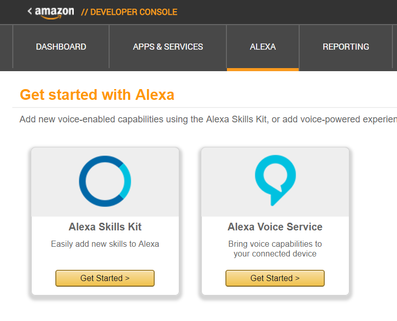
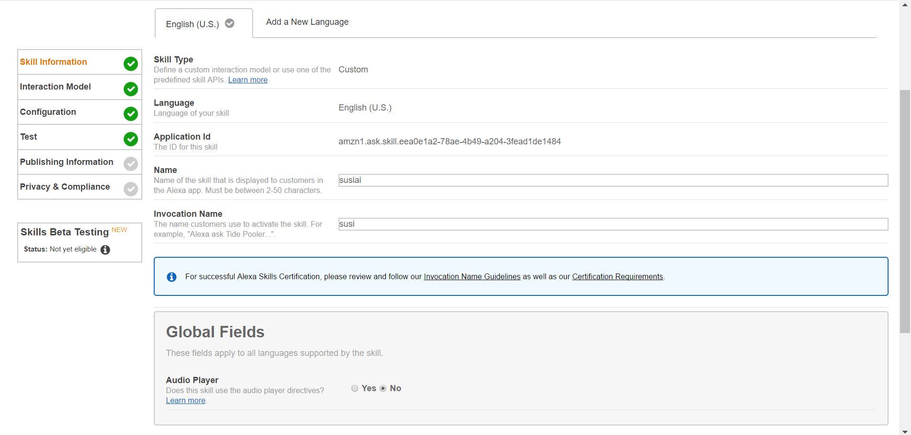
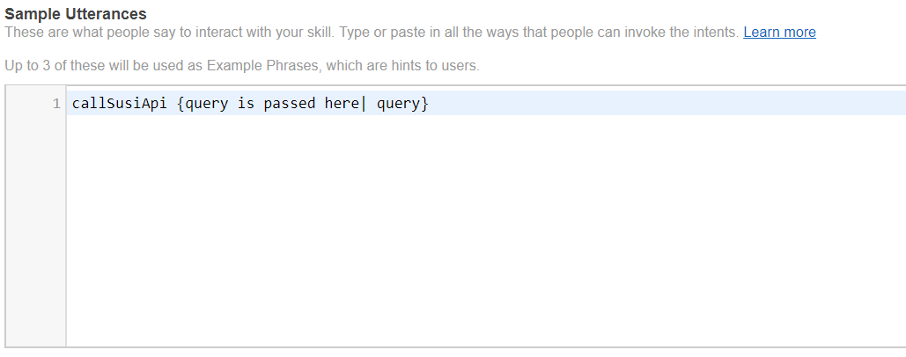
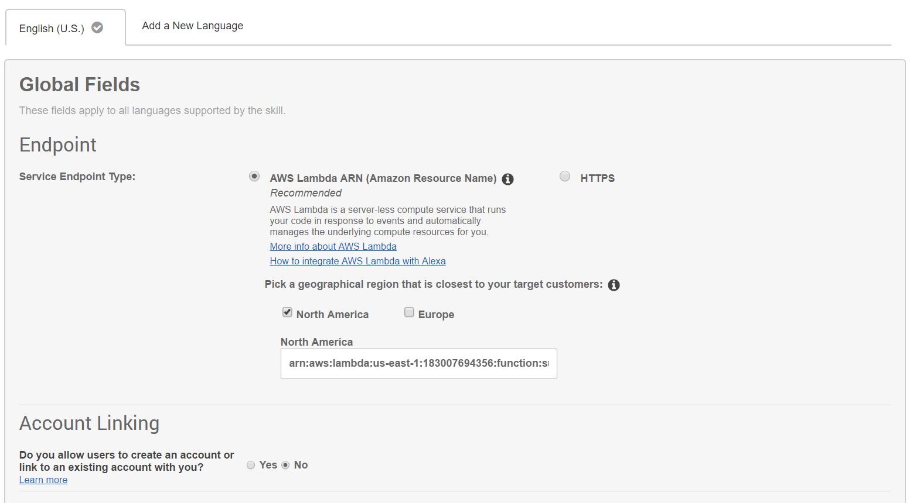
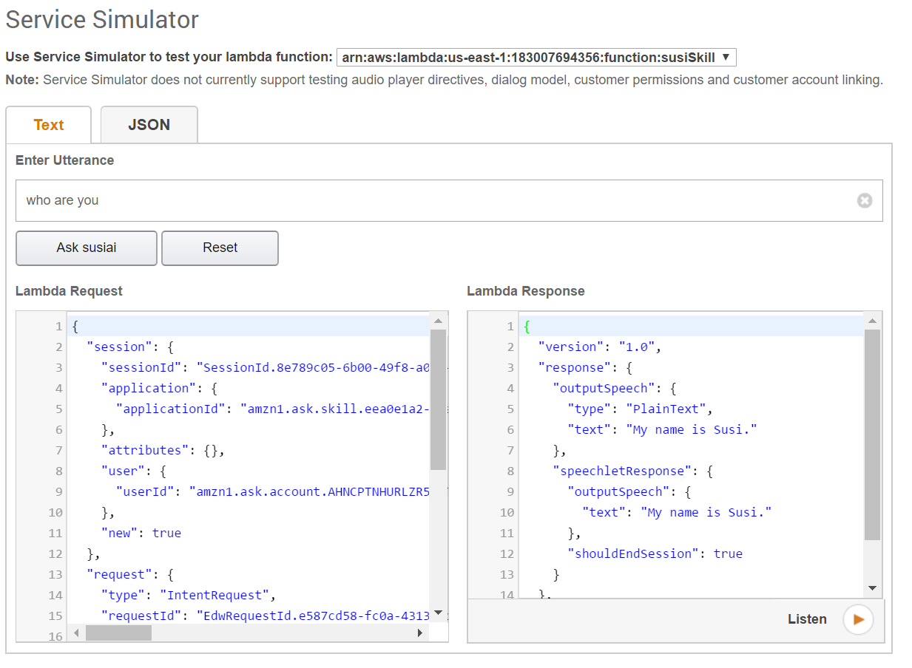

# Susi_Alexa_Skill
An alexa skill which can be used to ask susi for answers like: "Alexa, Ask Susi Who Are You" or "Alexa, Ask Susi what is the temperature in berlin"

# Getting Started : Alexa Susi AI Skill 

Follow the instructions below:

Visit [Amazon developer site](https://developer.amazon.com) and Login.

Click Alexa, on the top bar.

Click Alexa skills kit.

Click on add a new skill button on the top right of the page.

We will be at the skill information tab.

Write the name of the skill
Write the invocation name of the skill i.e. the name that will be used to trigger your skill. 
Like in our case, if we need to ask anything(as we have 'susi' as the invocation name), we will ask with "Alexa, ask Susi" as a prefix to our question sentence.

By clicking next, we will be redirected to the second tab i.e. Interaction model.
We need to fill two fields here i.e. intent schema and sample utterances.
For intent schema, we need to write all the available intents and the parameters for each of them. Like in our case i.e. intent_schema.json, we have a single intent 
that is "callSusiApi" and the parameter it accepts is "query" of type "AMAZON.LITERAL" (in simple words, a string type). 
Parameters are termed as slots here. The different types
of slots available, can be seen from [here](https://developer.amazon.com/public/solutions/alexa/alexa-skills-kit/docs/built-in-intent-ref/slot-type-reference). 

For sample utterances, we need to tell what utterances by the client will lead to what intent.
In our case: 

We have just one intent and the whole string uttered by the client should be fed to this intent as a "query" slot(parameter).

Let's click next now.

We will be shifted to the configuration tab.

We will host a server on Heroku, which will hold the code for our Susi skill, further we also need to link that code to this skill. 
To do this linking we need the name of the Heroku url. 

Fork this repository.

Host a [Heroku app](https://dashboard.heroku.com/new-app) and connect the fork of this repository to it.

Please select https option and copy that Heroku app's name and paste it into the field below region radio buttons.

Click next.

For SSL certificate, please select "My development endpoint is a sub-domain of a domain that has a wildcard certificate from a certificate authority" as we are using Heroku.

DONE!

Now we can test it with a sample query, when we get redirected to the test tab. 

Also we can test it using our voice through [reverb app](https://play.google.com/store/apps/details?id=agency.rain.android.alexa&hl=en) available on play store
or [echosim](https://echosim.io/) by logging into your amazon account.     

Some sample strings that we can speak to test it:
"Alexa, ask susi where are you"
"Alexa, ask susi tell me a joke"
"Alexa, ask susi what is a table"
(where 'susi' is the invocation name).

[This](https://www.youtube.com/watch?v=zt9WdE5kR6g) was the video that helped a lot in making this skill for Alexa. It can be referred too.